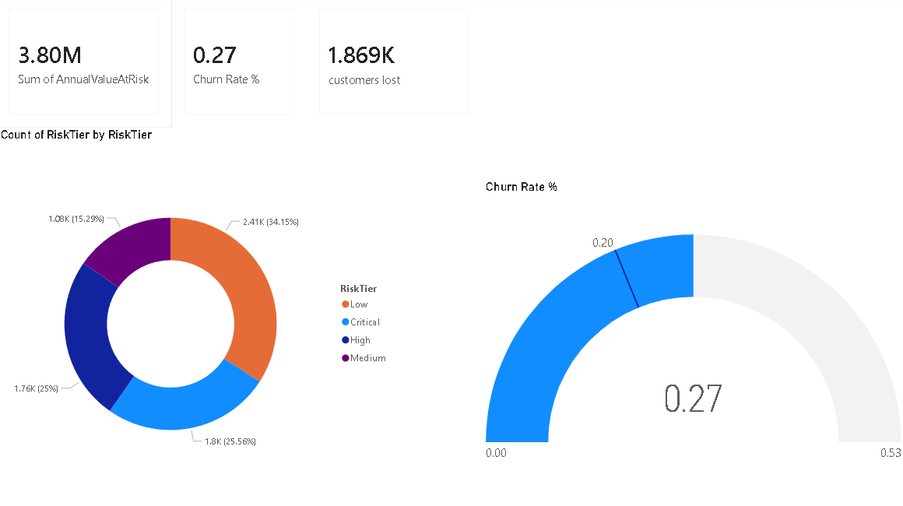
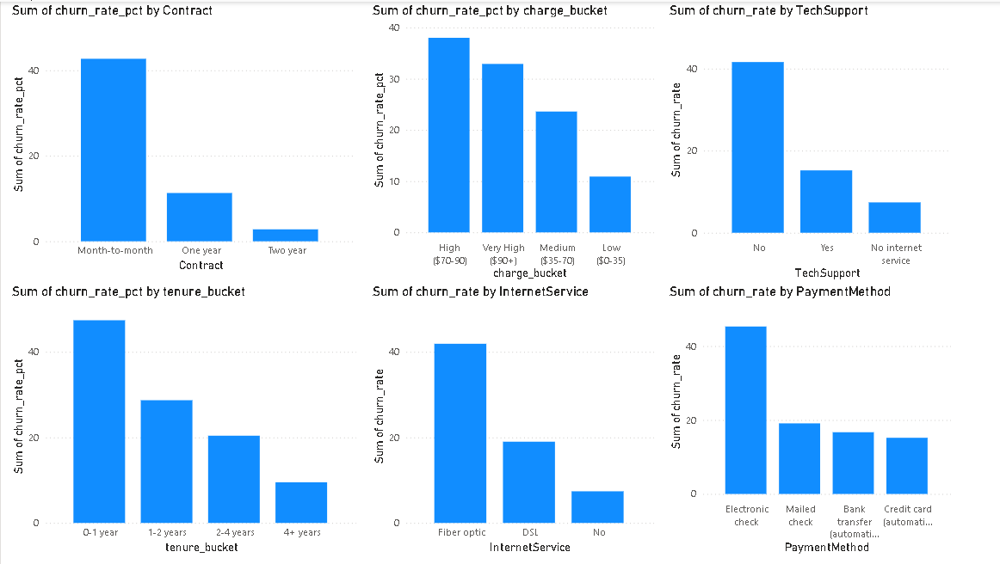
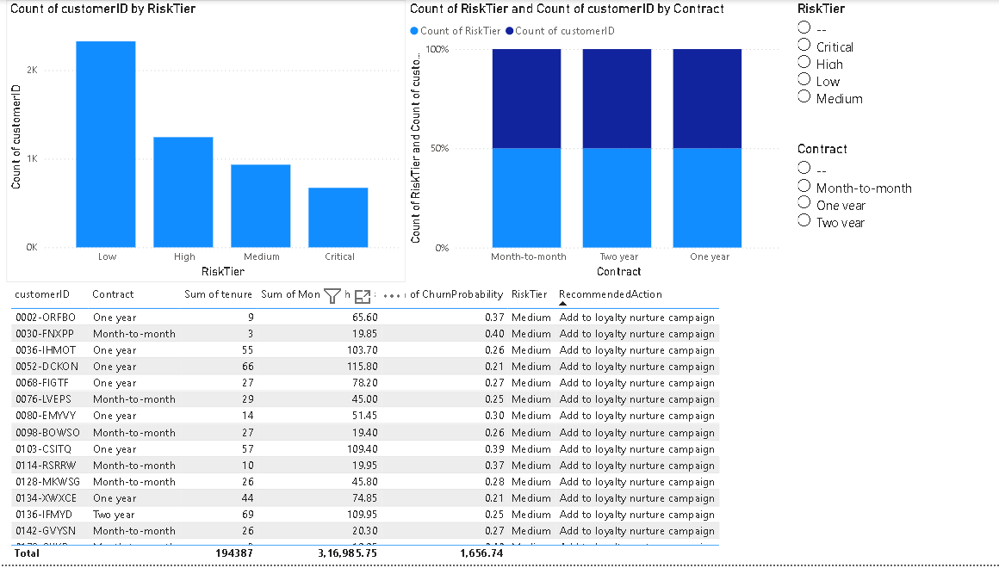
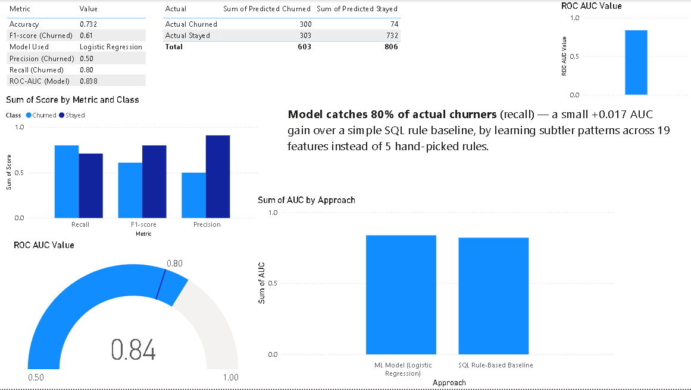

# TelcoChurn360 — End-to-End Churn Prediction & Retention Dashboard

An end-to-end churn prediction pipeline combining SQL analysis, a machine learning model, and an interactive Power BI dashboard — built to identify at-risk customers before they cancel and translate that insight into actionable, revenue-backed retention decisions.

---

## Table of Contents
- [Problem Statement](#problem-statement)
- [Tech Stack](#tech-stack)
- [Project Architecture](#project-architecture)
- [Repository Structure](#repository-structure)
- [Key Findings](#key-findings)
- [Model Performance](#model-performance)
- [Business Impact](#business-impact)
- [Dashboard Preview](#dashboard-preview)
- [How to Run](#how-to-run)
- [Dataset](#dataset)
- [Future Improvements](#future-improvements)

---

## Problem Statement

Subscription-based businesses (telecom, SaaS, banking) lose customers every month — this is called **churn**. Since acquiring a new customer typically costs far more than retaining an existing one, even a small reduction in churn has a significant impact on revenue.

This project answers three questions for a telecom provider:
1. **Why** do customers churn?
2. **Who** is likely to churn next?
3. **What** should the business do about it?

---

## Tech Stack

| Tool | Purpose |
|---|---|
| **SQLite** | Data storage and SQL-based segmentation analysis |
| **Python** (pandas, scikit-learn) | Data cleaning, feature engineering, ML modeling |
| **Power BI** | Interactive, stakeholder-facing dashboard |
| **Jupyter Notebook** | Analysis environment |

---

## Project Architecture

```
Raw CSV (Kaggle)
      │
      ▼
   SQLite (churn.db)  ──►  SQL segmentation + rule-based baseline
      │
      ▼
Python / scikit-learn  ──►  ML model (Logistic Regression), scores every customer
      │
      ▼
   SQLite (churn.db)  ──►  Model output + business action list written back
      │
      ▼
    Power BI           ──►  4-page interactive dashboard
```

The database is the single source of truth throughout — every step reads from it and writes results back into it, rather than passing data around as loose files.

---

## Repository Structure

```
TelcoChurn360-End-to-End-Churn-Prediction-Retention-Dashboard/
├── README.md
├── requirements.txt
├── .gitignore
├── data/
│   └── WA_Fn-UseC_-Telco-Customer-Churn.csv
├── setup_db.py                     # Loads CSV into SQLite
├── sql/
│   └── churn.sql                   # Raw SQL: segmentation + baseline views
├── notebooks/
│   ├── 01_eda_sql_analysis.ipynb   # SQL-driven descriptive analysis
│   ├── 02_churn_ml_model.ipynb     # ML model training + evaluation
│   └── 03_business_action.ipynb    # Risk scores → retention action list
├── outputs/
│   ├── retention_action_list.csv
│   ├── tier_summary.csv
│   └── segment_*.csv
├── dashboard/
│   ├── churn_dashboard.pbix
│   └── screenshots/
│       ├── page1_overview.png
│       ├── page2_why_churn.png
│       ├── page3_at_risk.png
│       └── page4_model_performance.png
└── churn.db                        # SQLite database (all tables/views)
```

---

## Key Findings

SQL-driven segmentation of 7,043 customers revealed clear churn drivers:

| Segment | Churn Rate |
|---|---|
| Month-to-month contract | **42.7%** |
| One-year contract | 11.3% |
| Two-year contract | 2.8% |
| Fiber optic internet | 41.9% |
| No tech support | 41.6% |
| Electronic check payment | 45.3% |

**88.6% of all churners were on month-to-month contracts** — by far the single largest lever. Churned customers also had a much shorter median tenure (10 months vs. 38 for retained customers), suggesting churn risk is highest in a customer's first year.

Full segment-level SQL analysis is in [`sql/churn.sql`](sql/churn.sql) and [`notebooks/01_eda_sql_analysis.ipynb`](notebooks/01_eda_sql_analysis.ipynb).

---

## Model Performance

Before building an ML model, a simple **rule-based baseline** was constructed directly in SQL (scoring customers on contract type, tenure, tech support, internet type, and monthly charges) to establish a floor the ML model needed to beat.

| Approach | ROC-AUC |
|---|---|
| SQL Rule-Based Baseline | 0.821 |
| **ML Model (Logistic Regression)** | **0.838** |
| Improvement | +0.017 |

**Classification report (Churned class):**

| Metric | Score |
|---|---|
| Precision | 0.50 |
| Recall | **0.80** |
| F1-score | 0.61 |
| Accuracy (overall) | 0.732 |

**Interpretation:** the model correctly identifies 80% of customers who go on to churn — the priority metric for a retention use case, since missing an at-risk customer is costlier than one extra, unnecessary retention outreach. The modest AUC improvement over the SQL baseline (+0.017) indicates that most of the predictive signal is captured by a handful of well-understood business factors, with the ML model adding smaller marginal lift by learning subtler interactions across all 19 features.

---

## Business Impact

Model scores were converted into risk tiers and matched to concrete retention actions:

| Risk Tier | Customers | Avg. Risk | Annual Revenue at Stake |
|---|---|---|---|
| Critical (>70%) | 394 | 78% | $364,934 |
| High (40–70%) | 1,042 | 54% | $882,748 |
| Medium (20–40%) | 1,148 | 29% | $956,453 |

**1,436 customers are High/Critical risk, representing $1.25M/year in revenue at stake.** Even a conservative 25% save-rate from targeted outreach is worth approximately **$312K/year** — the figure that would justify a retention program's budget to stakeholders.

Full action list logic is in [`notebooks/03_business_action.ipynb`](notebooks/03_business_action.ipynb).

---

## Dashboard Preview

**Page 1 — Executive Overview**


**Page 2 — Why Customers Churn**


**Page 3 — Who's At Risk**


**Page 4 — Model Performance**


---

## How to Run

```bash
# 1. Clone the repo
git clone https://github.com/ajaykpai895/TelcoChurn360-End-to-End-Churn-Prediction-Retention-Dashboard.git
cd TelcoChurn360-End-to-End-Churn-Prediction-Retention-Dashboard

# 2. Install dependencies
pip install -r requirements.txt

# 3. Load data into SQLite
python setup_db.py

# 4. Run the notebooks in order
jupyter notebook notebooks/01_eda_sql_analysis.ipynb
jupyter notebook notebooks/02_churn_ml_model.ipynb
jupyter notebook notebooks/03_business_action.ipynb

# 5. Open dashboard/churn_dashboard.pbix in Power BI Desktop
```

---

## Dataset

**IBM Telco Customer Churn** — 7,043 customers, 21 features
Source: [Kaggle](https://www.kaggle.com/datasets/blastchar/telco-customer-churn)

---

## Future Improvements

- Test tree-based models (Random Forest, XGBoost) and compare against the Logistic Regression baseline
- Add SHAP values for per-customer driver explanations, enabling personalized retention offers
- Run a live A/B test on retention outreach to validate the model's real-world impact, replacing the simulated impact-measurement framework with actual outcome data
- Tune the classification threshold to balance precision/recall based on the real cost of a false alarm vs. a missed churner

---

## Author

**Ajay K Pai**
GitHub: [@ajaykpai895](https://github.com/ajaykpai895)
